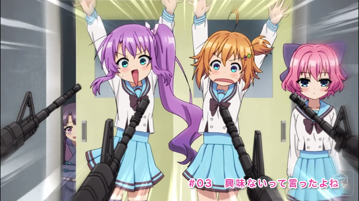

# kksk

Capture dmkt right now!

## Requirements

- Docker

## Usage

Let's capture 283 seconds(4:43) of the video(partId: 22863003).

```sh
$ make build
$ SESSION=xxxxxx PART=22863003 ARGS=283 make run
$ open out/22863003_283.png
```



### env variables

- `SESSION`: certificate_session_id
- `PART`: dmkt part id (e.g.: `22863003`)
